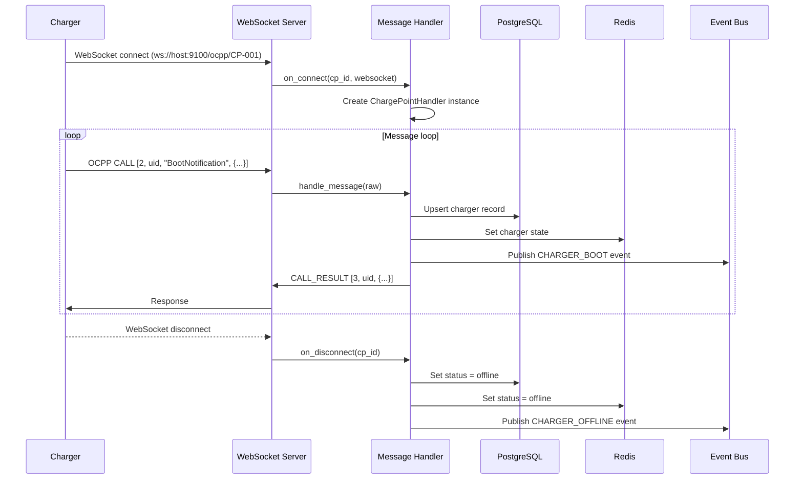

# Architecture

ocpp-core is an async Python service that acts as an OCPP Central System. It accepts WebSocket connections from EV chargers, processes OCPP messages, maintains state, and emits events for downstream consumers.

## Services

The application starts four concurrent services:

| Service | Port | Protocol | Purpose |
|---|---|---|---|
| OCPP 1.6j server | 9100 | WebSocket | Accepts OCPP 1.6j chargers |
| OCPP 2.0.1 server | 9201 | WebSocket | Accepts OCPP 2.0.1 chargers |
| REST API | 8000 | HTTP | Management and query API |
| Event bus | — | Redis Streams | Internal pub/sub |

All four run as asyncio tasks in the same event loop (`asyncio.gather`).

## Connection Flow



## Component Overview

```
main.py
├── OCPP16Server           # WebSocket listener, port 9100
│   └── ChargePointHandler # One instance per connected charger
│       ├── handle_message()
│       ├── _on_boot_notification()
│       ├── _on_heartbeat()
│       ├── _on_status_notification()
│       ├── _on_authorize()
│       ├── _on_start_transaction()  → session.py
│       ├── _on_stop_transaction()   → session.py
│       └── _on_meter_values()       → meter.py
│
├── OCPP201Server          # WebSocket listener, port 9201
│   └── ChargePointHandler201 (similar structure)
│
├── EventBus               # Redis Streams pub/sub
│
├── REST API (uvicorn)     # FastAPI app in api/
│
└── PKI CA                 # Built-in Certificate Authority
```

## State Model

State is stored in two layers with different persistence characteristics:

**Redis** — ephemeral, fast, survives process restarts (Redis is durable)
- Per-charger state: `charger:{cp_id}` hash — status, vendor, model, connectors
- Per-session state: `session:{session_id}` hash — live energy, power, duration
- Pending commands: `pending_start:{cp_id}:{id}` — queued RemoteStart commands

**PostgreSQL** — canonical, queryable
- `ocpp.charge_points` — charger registry with boot history
- `ocpp.connectors` — connector status per charger
- `ocpp.sessions` — completed and active charging sessions
- `ocpp.cdrs` — Charge Detail Records with cost calculation
- `ocpp.tokens` — RFID authorization tokens
- `ocpp.ocpp_messages` — full message log for audit

On startup, Redis is seeded from the last-known connector states in PostgreSQL so it survives a cold restart.

## Charger ID Extraction

Chargers identify themselves via the WebSocket URL path:

```
ws://your-host:9100/ocpp/CP-001
                         ^^^^^^
                         cp_id = "CP-001"
```

The path is parsed in `OCPP16Server._handler()`. The OCPP 1.6 spec calls this the "ChargePointIdentity".

## Message Handler Lifecycle

Each connected charger gets a `ChargePointHandler` instance that lives for the duration of the connection:

1. **Created** on WebSocket connect
2. **Profile resolved** on BootNotification (vendor/model/firmware → `ChargerProfile`)
3. **Messages processed** in a loop: parse → route → handle → respond
4. **Destroyed** on WebSocket disconnect (calls `on_disconnect()`)

The handler stores minimal per-connection state:
- `self.profile` — resolved charger profile
- `self._simulated` — True if this is a virtual test charger
- `self._pending_calls` — outstanding server→charger calls awaiting response

## Concurrency Model

Python asyncio — all I/O is non-blocking. Each charger connection runs as a coroutine awaiting messages. A single Python process can handle hundreds of concurrent charger connections.

Database operations use asyncpg connection pools. Redis uses aioredis. All async, no threads.

## Startup Sequence

```
1. load_dotenv()
2. Setup structured logging
3. Connect PostgreSQL pool
4. Connect Redis
5. Connect Event Bus (create Redis Streams if needed)
6. Initialize PKI CA (load from disk or generate new hierarchy)
7. Seed Redis from PostgreSQL connector states
8. Start all tasks concurrently:
   - OCPP 1.6j WebSocket server
   - OCPP 2.0.1 WebSocket server
   - Event bus consumers (billing, etc.)
   - REST API (uvicorn)
```
