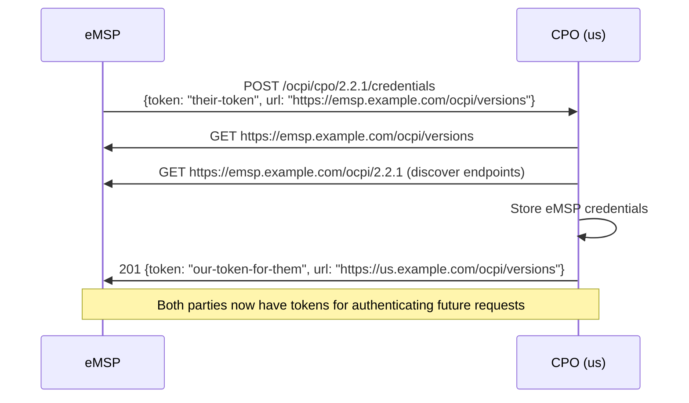
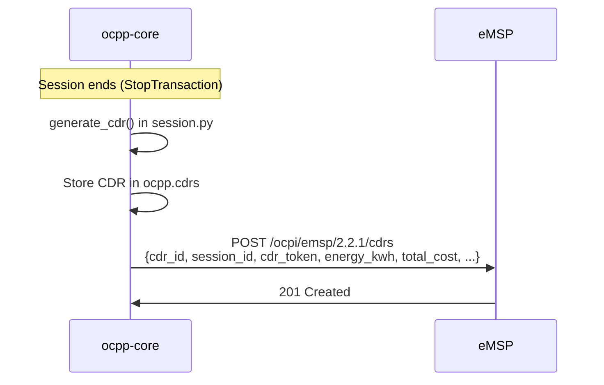

# OCPI 2.2.1 Integration

OCPI (Open Charge Point Interface) is the roaming protocol between Charge Point Operators (CPOs) and eMobility Service Providers (eMSPs). It allows drivers with a contract from one provider to charge at another provider's stations.

## Module Structure

```
ocpi/
├── main.py           # FastAPI router mounted at /ocpi
├── credentials.py    # Credential exchange (onboarding)
├── locations.py      # CPO locations and EVSE catalog
├── sessions.py       # Active/completed session data
├── cdrs.py           # Charge Detail Records (billing)
├── tariffs.py        # Pricing information
├── tokens.py         # Token whitelisting (real-time auth)
└── models.py         # Pydantic data models
```

## Endpoints

The OCPI module exposes these endpoints under `/ocpi/cpo/2.2.1/`:

| Module | Method | Path | Description |
|---|---|---|---|
| Credentials | `GET` | `/credentials` | Get our credentials |
| Credentials | `POST` | `/credentials` | Register a new eMSP |
| Credentials | `PUT` | `/credentials` | Update credentials |
| Credentials | `DELETE` | `/credentials` | De-register an eMSP |
| Locations | `GET` | `/locations` | All CPO locations |
| Locations | `GET` | `/locations/{location_id}` | Single location |
| Locations | `GET` | `/locations/{location_id}/{evse_uid}` | Single EVSE |
| Sessions | `GET` | `/sessions` | Ongoing/recent sessions |
| Sessions | `PUT` | `/sessions/{session_id}` | Update session (CPO push) |
| CDRs | `GET` | `/cdrs` | Completed CDRs for billing |
| CDRs | `POST` | `/cdrs` | Receive CDR from eMSP |
| Tariffs | `GET` | `/tariffs` | CPO tariff list |
| Tokens | `GET` | `/tokens` | Token whitelist |
| Tokens | `POST` | `/tokens/{token_uid}/authorize` | Real-time token authorization |

## Credential Exchange (Onboarding)

Before exchanging data, two OCPI parties must exchange credentials. This is done once during setup.



All subsequent OCPI requests include an `Authorization: Token {token}` header.

## Location Data

Locations represent physical charging sites. Each location has one or more EVSEs (charge points), each with one or more connectors.

```json
{
  "id": "LOC001",
  "type": "ON_STREET",
  "name": "Main Street Charging",
  "address": "Main Street 1",
  "city": "Amsterdam",
  "country": "NLD",
  "coordinates": {"latitude": "52.3676", "longitude": "4.9041"},
  "evses": [
    {
      "uid": "EVSE-001",
      "evse_id": "NL*CPO*E001*1",
      "status": "AVAILABLE",
      "connectors": [
        {
          "id": "1",
          "standard": "IEC_62196_T2",
          "format": "CABLE",
          "power_type": "AC_3_PHASE",
          "max_voltage": 230,
          "max_amperage": 32,
          "max_electric_power": 22000
        }
      ]
    }
  ]
}
```

The locations module reads from `ocpp.charge_points` and `ocpp.connectors` to build this response dynamically.

## CDR Flow

When a charging session completes on our CPO network using a foreign eMSP token, we push a CDR to the eMSP:



CDR fields populated from `ocpp.sessions` and `ocpp.cdrs`:
- `cdr_token` — the RFID/contract token used to start the session
- `energy_kwh` — session delta (not cumulative register)
- `total_cost` — calculated with VAT

## Token Authorization

For real-time token authorization (OCPI 2.2.1 Tokens module), an eMSP can ask us to authorize a token before the charger sends `Authorize`:

```
POST /ocpi/cpo/2.2.1/tokens/{token_uid}/authorize
```

This is the "Pull" model. We also support the "Push" model where eMSPs push their token whitelist to us via `GET /tokens` polling or `PUT /tokens/{uid}`.

## Configuration

OCPI configuration is in the main `.env`:

```env
OCPI_BASE_URL=https://your-cpo.example.com   # Public URL for OCPI
OCPI_PARTY_ID=OCP                             # Your 3-letter party ID
OCPI_COUNTRY_CODE=NL                          # Your 2-letter country code
OCPI_OPERATOR_NAME=My CPO
```

The `OCPI_BASE_URL` is advertised in credentials exchange so eMSPs know where to find your OCPI endpoints.
