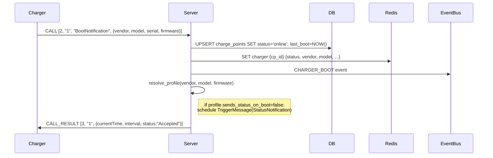
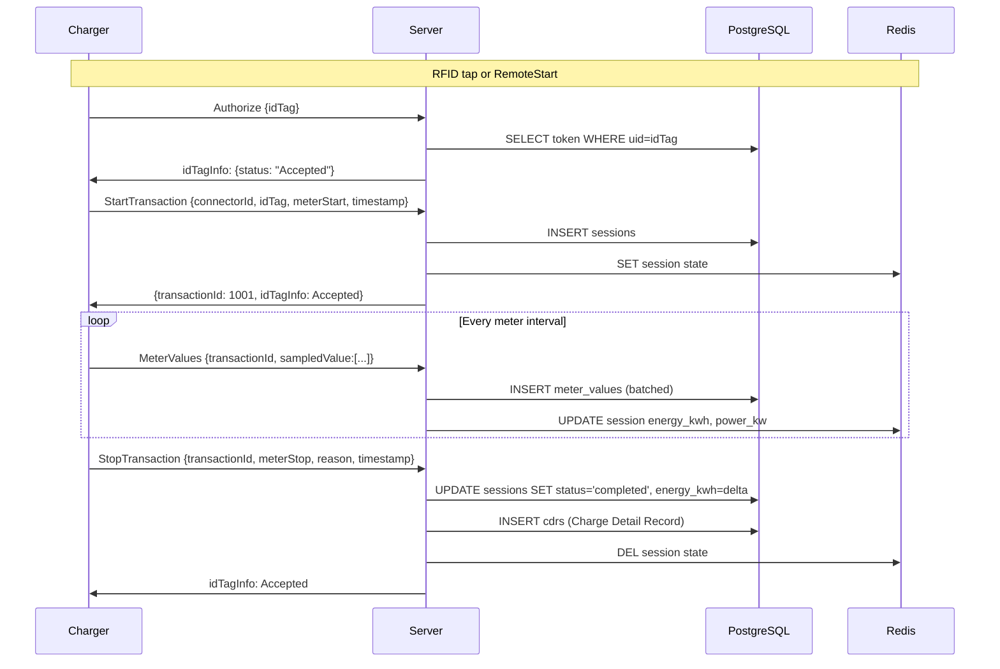

# OCPP 1.6j Implementation

## Connection

Chargers connect to:
```
ws://your-host:9100/ocpp/{ChargePointIdentity}
```

The charger ID is extracted from the URL path. The WebSocket subprotocol `ocpp1.6` is required — connections without it are rejected.

WebSocket-level pings are **disabled** (`ping_interval=None`). The OCPP heartbeat mechanism is used instead for liveness detection. This is intentional: some charger models do not respond to WebSocket ping frames.

## Message Format (OCPP-J)

OCPP over JSON uses arrays:

```
CALL:        [2, "unique-id", "Action", {payload}]
CALL_RESULT: [3, "unique-id", {payload}]
CALL_ERROR:  [4, "unique-id", "ErrorCode", "Description", {details}]
```

## Supported Actions (Charger → Server)

| Action | Handler | Description |
|---|---|---|
| `BootNotification` | `_on_boot_notification` | Charger startup, profile resolution |
| `Heartbeat` | `_on_heartbeat` | Liveness check, update `last_heartbeat` |
| `StatusNotification` | `_on_status_notification` | Connector status change |
| `Authorize` | `_on_authorize` | RFID/token authorization |
| `StartTransaction` | `_on_start_transaction` | Session started |
| `StopTransaction` | `_on_stop_transaction` | Session ended |
| `MeterValues` | `_on_meter_values` | Periodic energy/power readings |
| `DataTransfer` | `_on_data_transfer` | Vendor-specific data (accepted, not processed) |
| `FirmwareStatusNotification` | `_on_firmware_status` | Firmware update progress |
| `DiagnosticsStatusNotification` | `_on_diagnostics_status` | Diagnostics upload status |

## Supported Actions (Server → Charger)

| Action | Purpose |
|---|---|
| `RemoteStartTransaction` | Start a charging session |
| `RemoteStopTransaction` | Stop an active session |
| `ChangeConfiguration` | Update charger configuration |
| `GetConfiguration` | Read charger configuration |
| `TriggerMessage` | Request a specific message from the charger |
| `SetChargingProfile` | Apply smart charging limits |
| `ClearChargingProfile` | Remove smart charging profile |
| `Reset` | Soft or hard reboot |
| `UnlockConnector` | Unlock a stuck connector |
| `ChangeAvailability` | Set connector operative/inoperative |
| `GetDiagnostics` | Trigger diagnostics upload |
| `UpdateFirmware` | Trigger firmware update |

## BootNotification Flow



## Session Lifecycle



## Energy Calculation

**Important:** Energy.Active.Import.Register is a **cumulative lifetime counter** (Wh), not a per-session value.

```
session_energy_kwh = (meterStop - meterStart) / 1000.0
```

`meterStart` comes from `StartTransaction.meterStart`.  
`meterStop` comes from `StopTransaction.meterStop`.

This delta is stored in `ocpp.sessions.energy_kwh` (for billing) and `ocpp.cdrs.energy_kwh`. The raw register values are kept in `ocpp.sessions.meter_start` and `ocpp.sessions.meter_stop` for audit.

## Connector 0

OCPP 1.6 uses connector ID 0 for the whole charger (not a physical port). `StatusNotification` with `connectorId=0` reports charger-level status. It's tracked in Redis but **not** stored in the `ocpp.connectors` table (only connectors with `connector_id > 0` have DB rows).

## Authorization

The `Authorize` handler checks `ocpp.tokens`:
- `status = 'active'` AND within `valid_from`/`valid_until` → `Accepted`
- `status = 'blocked'` → `Blocked`
- Not found → `Invalid`
- Expired → `Expired`

ID tags starting with `APP_` are always accepted (used for payment-flow initiated sessions).

## Known Quirks

**StopTransaction(reason=Other)** — Some chargers send this on network reconnect, not just session end. The handler logs a warning but processes it normally. If you have a charger that does this aggressively, set `resumes_session_after_reconnect=True` in its profile and add custom handling.

**StatusNotification after boot** — Some chargers don't send this automatically. If the profile's `sends_status_on_boot=False`, the handler schedules a `TriggerMessage(StatusNotification)` 5 seconds after boot to request the current connector state.
